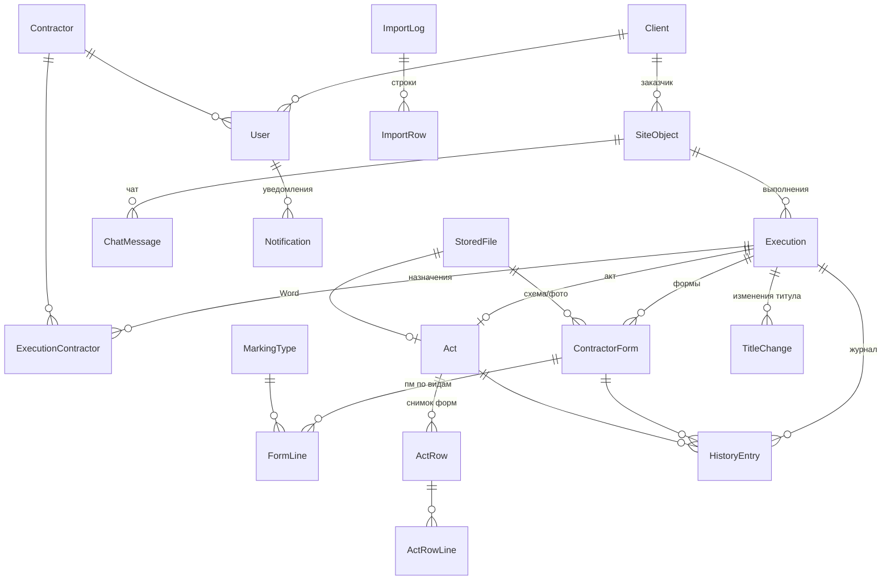

# Backend: NestJS + Prisma + PostgreSQL

Сервер системы согласования актов скрытых работ (дорожная разметка). Основа — «Сводный документ 09.09.26»
и решения, принятые в бета-прототипе. Вся бизнес-логика (статусы, сверка с титулом, права ролей,
нумерация актов, напоминания) выполняется на сервере; фронтенд в API-режиме только отображает данные и вызывает действия.

## Быстрый старт

```bash
# 1. База и хранилище
cd backend
cp .env.example .env          # задать JWT_SECRET; STORAGE=local не требует MinIO
npm i
npm run db:up                 # PostgreSQL 17 + MinIO в Docker (или свой PostgreSQL)
npm run db:deploy             # применить миграции
npm run db:seed               # демо-данные: те же объекты и пользователи, что в прототипе (пароль 123)

# 2. Фронтенд для сервера (в корне репозитория)
cd .. && npm i && npm run build:api      # → dist-api (VITE_API=1)

# 3. Сервер: API на /api, фронтенд на /
cd backend && npm run build && npm start # http://localhost:3000
```

Выкладка на сервер (Docker, Selectel, автодеплой из GitHub): [`deploy/README.md`](../deploy/README.md).

Разработка с горячей перезагрузкой фронтенда: сервер запущен на :3000, в корне `npm run dev:api`
(Vite на :5173 проксирует `/api` на :3000).

## Скрипты (backend)

| Команда | Что делает |
|---|---|
| `npm run build` | компиляция TypeScript → `dist/` |
| `npm start` | `node --env-file=.env dist/main.js` |
| `npm run start:prod` | без `.env`, переменные из окружения |
| `npm run test:e2e` | API-тест, 43 проверки (**меняет БД** — перед запуском `npm run db:seed`) |
| `python3 test/ui-api.py` | UI-тест в браузере (Playwright), 17 проверок; сервер должен раздавать `dist-api`, перед запуском `db:seed` |
| `npm run db:seed` | **стирает базу** и заливает демо-данные; при `NODE_ENV=production` только с `SEED_RESET=1` |
| `npm run db:init` | чистая база для работы: настройки, справочник видов разметки, ГП из `ADMIN_LOGIN`/`ADMIN_PASSWORD`; ничего не удаляет |
| `npm run db:reset` / `db:studio` | пересоздать схему / посмотреть данные |

## Структура

```
src/
  main.ts, app.module.ts      — префикс /api, раздача dist-api, cron
  auth/                        — вход, JWT (30 дней, инвалидация по passwordChangedAt), guard ролей
  workflow/                    — objects / forms / acts сервисы, единый ApiController
  state/                       — GET /api/state: снимок данных с учётом роли (фильтрация по подрядчику/заказчику)
  files/                       — загрузка PDF, выдача с проверкой прав; local или S3
  notifications/               — уведомления, Telegram (привязка кодом, webhook), напоминания 2/5 дней (каждый час)
  admin/                       — справочники, пользователи, настройки (только ГП)
test/api.e2e.ts, test/ui-api.py
```

## API (префикс `/api`, JWT в `Authorization: Bearer`)

| Метод и путь | Роли | Назначение |
|---|---|---|
| `GET health` | все | проверка живости |
| `POST auth/login`, `GET auth/me`, `POST auth/password` | — / все | вход, текущий пользователь, смена пароля (возвращает новый токен) |
| `GET state` | все | данные, доступные роли |
| `POST/PUT/DELETE objects[/:id]`, `POST objects/:id/executions`, `PUT/DELETE executions/:id` | ГП, заказчик | объекты и выполнения; изменение титула — с причиной |
| `POST executions/:id/form` `{lines, schemeFileId, photoFileId, submit}` | подрядчик | черновик / подача формы |
| `POST forms/:id/withdraw` | подрядчик | отзыв формы |
| `POST forms/:id/approve`, `forms/:id/reject` `{comment}` | заказчик | решение по форме |
| `POST acts/:id/approve`, `acts/:id/return` `{contractorIds, comment}`, `acts/archive` `{actIds}` | ГП, менеджер | согласование, возврат, архив |
| `POST acts/:id/correct` `{rows, reason}` | ГП | корректировка после согласования |
| `POST acts/:id/word` | ГП, менеджер, заказчик | .docx (пока пустой шаблон) |
| `POST objects/:id/chat`, `POST notifications/read` | все | чат, прочтение уведомлений |
| `POST files` (multipart `file`, `kind`), `GET files/:id` | подрядчик / по правам | PDF-файлы |
| `admin/users`, `admin/contractors`, `admin/clients`, `admin/marking-types` (POST, PUT/:id, DELETE/:id), `PUT admin/settings`, `POST admin/reminders/run` | ГП | администрирование |
| `POST me/telegram-code`, `POST me/telegram-unlink`, `POST telegram/webhook` | все / бот | Telegram |

Ошибки бизнес-правил возвращаются как `400` с русским сообщением (оно показывается пользователю как есть), `401` — нет входа, `403` — нет прав.

## Что проверено
- `test/api.e2e.ts` — 43 проверки: полный цикл формы → акт → согласование → Word → архив, возвраты, отзыв, авто-нули, изменение титула, права ролей, лимит объёма объекта, загрузка/выдача файлов, корректировка, напоминания.
- `test/ui-api.py` — 17 проверок в браузере: вход/ошибка входа, сессия после перезагрузки, подача форм двумя подрядчиками, подсветка превышения, одобрение заказчиком, синхронизация второго окна, согласование ГП и скачивание Word, чат, админка, смена пароля.
- Ограничения базы: повторный `excelRowNumber`, вторая форма подрядчика в выполнении, удаление заказчика с объектами — отклоняются; удаление объекта каскадно удаляет выполнения, формы, акт и чат.
- Конкурентность: операции над выполнением берут `SELECT … FOR UPDATE`, номер акта — атомарный инкремент `Settings.actCounter`.

## Ключевые решения

| Тема | Решение |
|---|---|
| ID | UUID; `excelRowNumber` — отдельное `@unique` (NULL для объектов, созданных вручную) |
| Объёмы | `Decimal(12,3)`, без ошибок округления float |
| пм → м² | `FormLine`: пм + **снимок** `widthM`/`fillRatio` + `areaM2`. Смена справочника не меняет старые акты |
| Титул | Один общий м² на выполнение; Σ выполнений ≤ объём объекта (проверка в сервисе) |
| Изменение титула | `TitleChange` (было/стало/причина/`duringApproval`) + `HistoryEntry.highlight` + уведомление `IMPORTANT` |
| Акт | Один на выполнение, `round` +1 при возврате; `ActRow`/`ActRowLine` — снимок форм и файлов |
| Word | `Act.wordFileId` → `StoredFile` в S3. Ссылка отдаётся как signed URL на 1 час, поэтому хранится файл, а не URL (в ТЗ было `wordFileUrl`) |
| Журнал | Единый `HistoryEntry` для выполнения, формы и акта. `hiddenFromClient` скрывает комментарии ГП от заказчика, `visibleToContractorId` показывает комментарий только своему подрядчику |
| Уведомления | `kind` (ACTION / IMPORTANT / REMINDER / INFO) + привязка к объекту/выполнению/акту для группировки. `dedupeKey` защищает напоминания и дайджесты от дублей. Отдельно хранится статус доставки в Telegram |
| Напоминания 2/5 дней | `Execution.lastActivityAt` + `reminderLevel`, сроки в `Settings` |
| Авторизация | `passwordChangedAt` инвалидирует старые JWT; `TelegramLinkToken` нужен для привязки бота |
| Импорт | `ImportLog` (кто, когда, счётчики) + `ImportRow` (статус `IMPORT_CONFLICT`/`ERROR`, сырые данные в JSON, решение OVERWRITE/CREATE_NEW/SKIP) |
| Удаление | Каскад от объекта. Запрет удаления при согласованном или архивном акте проверяется в сервисе |
| Номер акта | `Settings.actCounter`, инкремент в транзакции → `АСР-0001` |

## Связи



## Таблицы (22)
`users`, `telegram_link_tokens`, `contractors`, `clients`, `marking_types`, `objects`, `executions`,
`execution_contractors`, `title_changes`, `contractor_forms`, `form_lines`, `acts`, `act_rows`,
`act_row_lines`, `history_entries`, `stored_files`, `chat_messages`, `chat_read_marks`,
`notifications`, `import_logs`, `import_rows`, `settings`.
