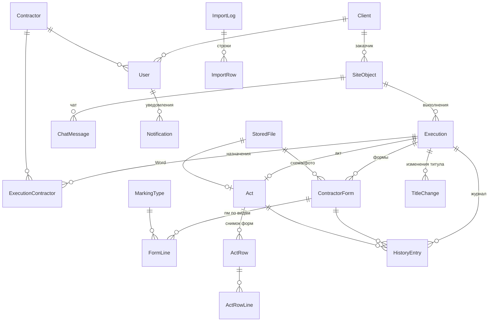

# Backend: схема БД (Prisma + PostgreSQL)

Модель данных для системы согласования актов скрытых работ (дорожная разметка).
Основа — «Сводный документ 09.09.26» (раздел 11) и решения, принятые в бета-прототипе.

## Быстрый старт

```bash
cd backend
cp .env.example .env
npm i
npm run db:up        # PostgreSQL 17 + MinIO в Docker
npm run db:migrate   # применить миграции (prisma/migrations)
npm run db:seed      # демо-данные: те же объекты и пользователи, что в прототипе (пароль 123)
npm run db:studio    # посмотреть данные в браузере
```

## Что проверено
- `prisma validate` и `prisma format`: без ошибок. Миграция `init` применена на PostgreSQL 17.
- Seed отрабатывает, повторный запуск без ошибок. Суммы форм совпадают с титулами там, где это нужно по сценарию.
- Ограничения базы срабатывают:
  - повторный `excelRowNumber` отклоняется;
  - вторая форма того же подрядчика в выполнении отклоняется;
  - заказчика с объектами удалить нельзя;
  - удаление объекта каскадно удаляет выполнения, формы, акт и чат.

## Ключевые решения

| Тема | Решение |
|---|---|
| ID | UUID; `excelRowNumber` — отдельное `@unique` (NULL для объектов, созданных вручную) |
| Объёмы | `Decimal(12,3)`, без ошибок округления float |
| пм → м² | `FormLine`: пм + **снимок** `widthM`/`fillRatio` + `areaM2`. Смена справочника не меняет старые акты |
| Титул | Один общий м² на выполнение; Σ выполнений ≤ объём объекта (проверка в сервисе) |
| Изменение титула | `TitleChange` (было/стало/причина/`afterApproval`) + `HistoryEntry.highlight` + уведомление `IMPORTANT` |
| Акт | Один на выполнение, `round` +1 при возврате; `ActRow`/`ActRowLine` — снимок форм и файлов |
| Word | `Act.wordFileId` → `StoredFile` в S3. Ссылка отдаётся как signed URL на 1 час, поэтому хранится файл, а не URL (в ТЗ было `wordFileUrl`) |
| Журнал | Единый `HistoryEntry` для выполнения, формы и акта. `hiddenFromClient` скрывает комментарии ГП от заказчика, `visibleToContractorId` показывает комментарий только своему подрядчику |
| Уведомления | `kind` (ACTION / IMPORTANT / REMINDER / INFO) + привязка к объекту/выполнению/акту для группировки. `dedupeKey` защищает напоминания и дайджесты от дублей. Отдельно хранится статус доставки в Telegram |
| Напоминания 2/5 дней | `Execution.lastActivityAt` + `reminderLevel`, сроки в `Settings` |
| Авторизация | `passwordChangedAt` инвалидирует старые JWT; `TelegramLinkToken` нужен для привязки бота |
| Импорт | `ImportLog` (кто, когда, счётчики) + `ImportRow` (статус `IMPORT_CONFLICT`/`ERROR`, сырые данные в JSON, решение OVERWRITE/CREATE_NEW/SKIP) |
| Удаление | Каскад от объекта. Запрет удаления при согласованном или архивном акте проверяется в сервисе |
| Номер акта | `Settings.actCounter`, инкремент в транзакции → `АСР-0001` |

## Связи



## Таблицы (22)
`users`, `telegram_link_tokens`, `contractors`, `clients`, `marking_types`, `objects`, `executions`,
`execution_contractors`, `title_changes`, `contractor_forms`, `form_lines`, `acts`, `act_rows`,
`act_row_lines`, `history_entries`, `stored_files`, `chat_messages`, `chat_read_marks`,
`notifications`, `import_logs`, `import_rows`, `settings`.
